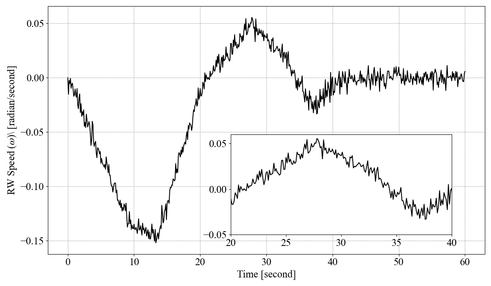
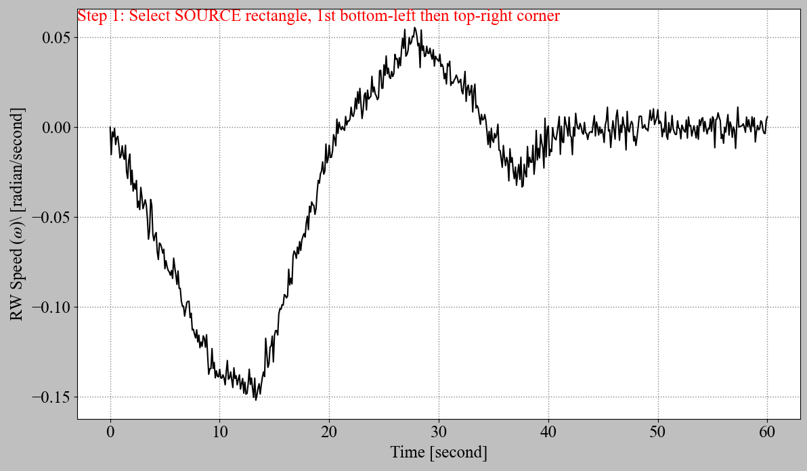

# 1. Python Professional Plots
Code example and function to help generate manuscript-worthy plots in Python with interactive zoom plots

- [1. Python Professional Plots](#1-python-professional-plots)
- [2. Single plots](#2-single-plots)
- [3. Zoom plots](#3-zoom-plots)
  - [Inputs](#inputs)
  - [Output](#output)


This script is to help researchers and alike produce manuscript-worthy plots in MATLAB without having to do too much work.

it has 3 main components
- sample plotting practises
- maximizing plot area using subplotter function
- adding zoom sub-axis to your plot for magnification

# 2. Single plots
An example of a single plot with zoomed axes is shown below



# 3. Zoom plots
There is a function written by Dr. Rahimi to help quickly and if needed interactively add zoom plots to your existing axes.

you can simply call the function with 
```python
zoomPlot(fig, ax)
# which is equivalent to
zoomPlot(fig, ax,srcLoc=[],desLoc=[],conVec=[])
# or add some additional options
zoomPlot(fig, ax,srcLoc=[],desLoc=[],conVec=[],showticks=False,color='blue')
```

**Note** that if you leave the 2nd, 3rd, and 4th, elements in the function as empty (i.e.,[]), which is the default, then the function will work interactively to help you place your zoomed axes on your main axis. It will also give you the final elements in the command window so you can use it in future to hard-code them in your main script after you identify the elements interactively

Below is a quick animation of the functionality of the function


After you finalized your zoom plot with interactions as showns above, the function shows the final values for the not-given elements in the output window something similar to below

```python
desLoc = [0.602  -5 1.96 -1.26], srcLoc = [0.356 -1.18 0.71 1.23], conVec = [3 4 2 1]
```

With this information you can update your code to have this vectors hard-coded in the main script so you don't have to do the interactions every time you run your code. So you would end up with something similar to below

```python
zoomplot(fig,ax,desLoc = [0.602  -5 1.96 -1.26], srcLoc = [0.356 -1.18 0.71 1.23], conVec = [3 4 2 1], showticks=False)
```

Note that you can have any of the 3 elments inputted as empty (i.e., []) and if they are empty, the function (zoomPlot) will either ask you to input them (for srcLoc and desLoc) or automatically determines their value (conVec)

below is a list of all arguments and options for zoomPlot function
## Inputs
| Argument | Type | Required | Default | Description |
| ------------- | ------------- | ------------- | ------------- | ------------- |
| fig | figure | Required | N/A | The figure the zoom axes will be inserted in |
| srcAx | axis | Required | N/A | The axis inside fig that the zoom axes will be inserted in  |
| srcLoc | [1x4] | Optional | [] | Location of the source box in the srcAx in data units of srcAxis |
| desLoc | [1x4] | Optional | [] | Location of the zoomed box axis in the srcAx in data units of srcAxis |
| conVec | [1x4] | Optional | [] | Connector vector for lines between source and destination boxes |
| color | color value or string | | 'red' | The color for the highliught box and the connection lines |
| linewidth | decimal | Optional | 1 | The linewidth (thickness) for the highlight box and connectors |
| showconnectors | bool | Optional | True | The boolean to set whether to show the connector lines or not |
| showhighlightbox | bool | Optional | True | The boolean to set wether to show the highlight box or not |
| showticks | bool | Optional | True | The boolean to set whether to show the ticks on x and y axis of the added zoom axis |
                                          

## Output
| Argument  | Description |
| ------------- | ------------- |
| zoomax| Added zoom plot axis (Axis) |

and here is additional information on the function and its inputs and outputs

```python
    # This functions helps add a zoom sub axis to your existing plot
    # It is very useful when you need to add magnieifed portions to your plot
    # to give your viewer a better understanding of what is going on in a 
    # region of the plot that is very crowded
```